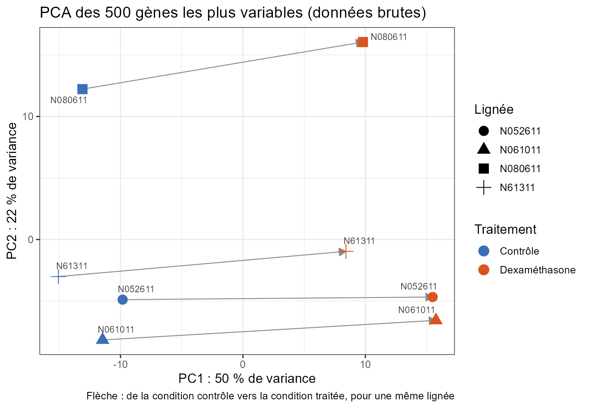
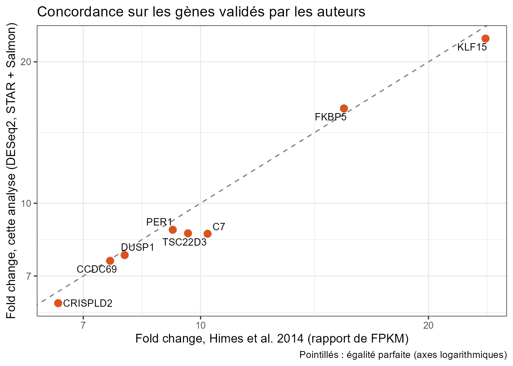
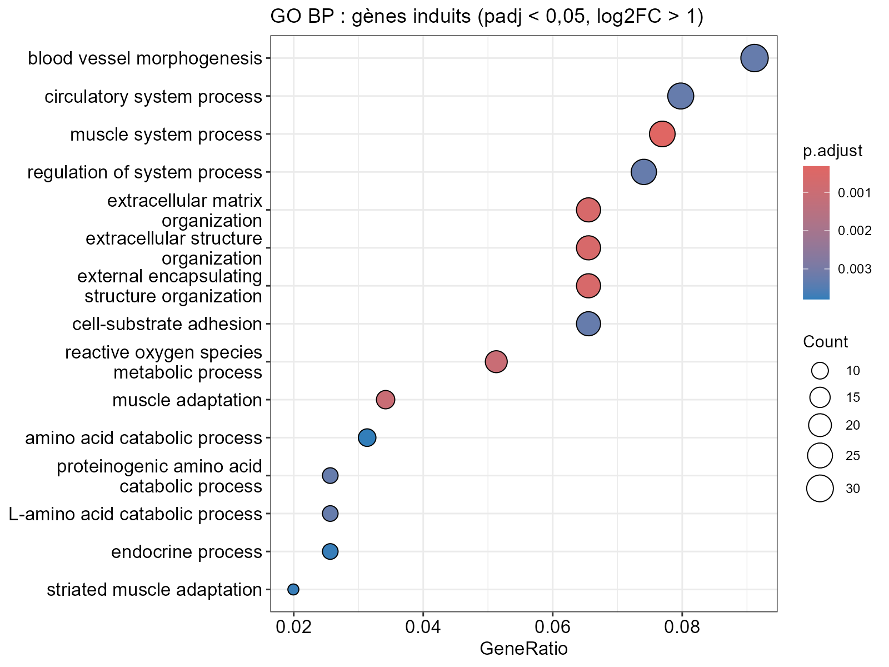

# Transcriptional response to dexamethasone in airway smooth muscle cells

Reproducible RNA-seq pipeline (**nf-core/rnaseq 3.27.0**, Nextflow, Apptainer/SLURM) and differential
expression analysis (**DESeq2**) of the public dataset **GSE52778** ("airway"), with a quantitative
comparison to the results of the original paper.

<p align="center"></p>

## Biological question

Which genes change expression when human airway smooth muscle (ASM) cells are treated with
**dexamethasone**, an anti-inflammatory glucocorticoid used in asthma? And can the published results be
**recovered with a modern, different analysis pipeline**?

## Data

- **GSE52778** ([GEO](https://www.ncbi.nlm.nih.gov/geo/query/acc.cgi?acc=GSE52778)), 75 bp paired-end
  reads, Illumina HiSeq 2000.
- 4 primary ASM cell lines (`N61311`, `N052611`, `N080611`, `N061011`), each **treated or untreated**
  (dexamethasone 1 µM, 18 h): **8 paired samples**.
- SRA runs: `SRR1039508`, `509`, `512`, `513`, `516`, `517`, `520`, `521` (see `ids.csv`).

**Reference:** Himes BE *et al.*, *RNA-Seq Transcriptome Profiling Identifies CRISPLD2 as a Glucocorticoid
Responsive Gene that Modulates Cytokine Function in Airway Smooth Muscle Cells*, PLoS ONE 2014;9(6):e99625,
[doi:10.1371/journal.pone.0099625](https://doi.org/10.1371/journal.pone.0099625).

## Methods

| Step | Tool |
|---|---|
| Download | ENA (`wget`), GRCh38 genome + GENCODE v44 annotation |
| Pipeline | `nf-core/rnaseq` **3.27.0**, `--aligner star_salmon` |
| Alignment / quantification | STAR, Salmon |
| Quality control | FastQC, Trim Galore, RSeQC, Qualimap, Picard, **MultiQC** |
| Count import | `tximport` |
| Differential expression | `DESeq2`, design **`~ cell + dex`**, `lfcShrink` (apeglm) |
| Enrichment | `clusterProfiler` (GO, KEGG) |

The `~ cell + dex` design treats the cell line as a blocking covariate: each treated line is compared with
its own untreated counterpart. This removes donor-to-donor variability from the test noise.

## Data quality (MultiQC)

All 8 samples are of good quality and consistent with each other:

- **16.5 to 33.7 million read pairs** per sample;
- **93.2 to 94.8% uniquely aligned reads** (STAR);
- **unstranded** protocol, confirmed by RSeQC (~46% sense, ~46% antisense);
- 13.6 to 20% duplicates (typical for RNA-seq); the vast majority of reads fall in exons and very few in
  introns (RSeQC), as expected for mature mRNA.

## Results

Out of **16,380 genes** tested, **3,587** are significant (padj < 0.05): 1,950 induced and 1,637
repressed. **767** of them also have |log2FC| > 1.

### Treatment dominates, donor is secondary

The PCA (top of this page) separates treated from control samples on PC1 (50% of the variance). PC2 (22%)
mostly separates the `N080611` cell line. Arrows connect each cell line between its two conditions: they
all point the same way, with different magnitudes. This justifies the `cell` term in the model.

### Induced and repressed genes

<p align="center"></p>

The most strongly and significantly changed genes are mostly **induced** (right), with `DUSP1` at the top
of the ranking. Many genes are also **repressed** (for example `VCAM1`, `CXCL12`, `SOX4`). The 40 most
significant genes clearly separate treated from control samples in every donor
([heatmap](figures/heatmap_top40.png)).

## Comparison with the reference paper

### Validated genes are recovered with matching fold changes

<p align="center"></p>

The authors validated eight genes by qPCR and report their mean FPKM with and without dexamethasone. The
ratio of the two is compared below with our DESeq2 fold change (`2^log2FC`, shrunken).

| Gene | FC paper (FPKM ratio) | FC here (DESeq2) | padj here |
|---|---|---|---|
| `KLF15` | 23.8 | 22.4 | 4.3e-74 |
| `FKBP5` | 15.5 | 15.9 | 4.7e-26 |
| `C7` | 10.2 | 8.6 | 2.6e-12 |
| `TSC22D3` | 9.6 | 8.6 | 6.4e-19 |
| `PER1` | 9.2 | 8.8 | 2.1e-49 |
| `DUSP1` | 7.9 | 7.8 | 1.4e-131 |
| `CCDC69` | 7.6 | 7.5 | 3.8e-64 |
| `CRISPLD2` | 6.5 | 6.1 | 4.1e-47 |

- The **four known glucocorticoid-responsive genes** cited by the authors (`DUSP1`, `KLF15`, `PER1`,
  `TSC22D3`), as well as `FKBP5`, are all induced and highly significant.
- The **three novel genes** highlighted by the authors (`CRISPLD2`, `C7`, `CCDC69`) are recovered.
  `CRISPLD2`, the paper's main finding, is reproduced with a fold change of about 6.
- The paper's values were taken from its text and should be double-checked against the original table
  before being cited.

This agreement is obtained with tools and a genome different from those of the paper
(STAR/Salmon/DESeq2 on GRCh38 versus TopHat/Cufflinks/Cuffdiff on hg19).

### Functional enrichment

<p align="center"></p>

Induced genes are enriched in **extracellular matrix organization**, **cell-substrate adhesion**,
**blood vessel morphogenesis** and **circulatory system processes**. These themes overlap with those
reported by the authors (extracellular matrix/glycoproteins, vasculature development, circulatory system
processes). Muscle-related processes are also enriched, consistent with the cell type. KEGG recovers
integrin signaling and ECM-receptor interaction.

### Where results differ

| | Paper | Here |
|---|---|---|
| Significant genes | **316** | **3,587** |

I have no demonstrated explanation for this gap. Plausible causes are a more powerful test when the donor
is modeled (DESeq2 with `~ cell + dex`), the conservative behavior of Cuffdiff with few replicates, and
different annotations (RefSeq/hg19 versus GENCODE v44/GRCh38). I could not measure the exact overlap of the
two gene lists. What is solid is that **the strong, validated genes are the same**.

## Full report

[`analysis/deseq2_analysis.html`](analysis/deseq2_analysis.html) contains every figure (PCA, sample
distances, volcano, heatmap, comparison with the paper, GO and KEGG) with a commentary for each. The
report text is written in French.

## Reproducing the analysis

### On a SLURM cluster (run on Narval, Digital Research Alliance of Canada)

```bash
# 1. Data (login node, with Internet access): FASTQ + genome + samplesheet.csv
bash scripts/00_fetch_data.sh

# 2. Pipeline and containers, downloaded in advance (compute nodes have no Internet)
nf-core pipelines download rnaseq -r 3.27.0 --container-system singularity --outdir nf-core-rnaseq

# 3. Run (set your account in run_slurm.sh and conf/slurm.config)
sbatch run_slurm.sh
```

### Downstream analysis (R 4.4, Quarto)

```bash
Rscript analysis/install_packages.R        # once
quarto render analysis/deseq2_analysis.qmd
```

### On a laptop (not tested)

`run_laptop.sh` runs a lighter version (Salmon pseudo-alignment only, Docker, ~16 GB RAM). It was not
executed in this project: versions and options must be checked before use.

### Things to know

- `nf-core/rnaseq` 3.27.0 requires Nextflow >= 25.10.4, which is not available on Narval. The run used
  **Nextflow 26.04.4 with `NXF_SYNTAX_PARSER=v1`**; without it the pipeline configuration cannot be parsed.
- The pipeline was run **offline**: one container image (DESeq2 quality control) was missing from the cache
  and was pulled manually with `apptainer pull`.
- With `nf-core` 4.1.0, `nf-core pipelines download` crashes on a missing import; a workaround is to import
  `rich.prompt` beforehand.
- FASTQ files, BAM files and pipeline outputs are not versioned (see `.gitignore`).

## Limitations

- **Four donors only**, all white males without asthma (a limitation noted by the authors): results do not
  necessarily generalize to asthmatic patients.
- **A single time point** (18 h) and **a single dose** (1 µM).
- GO enrichments are broad and redundant; their adjusted p-values are around 1e-3.
- This work reproduces an expression signature; the link between `CRISPLD2` and asthma comes from the
  genetics and experiments of the paper, not from this analysis.

## Repository layout

```
├── README.md
├── ids.csv, metadata.csv        # samples and design
├── run_slurm.sh, run_laptop.sh  # pipeline launchers
├── conf/                        # configs (SLURM/Apptainer, laptop/Docker)
├── scripts/                     # data download, samplesheet
├── analysis/                    # deseq2_analysis.qmd (+ .html) and R package installer
├── figures/                     # main figures
└── results_deseq2.csv           # full DESeq2 results (16,380 genes)
```
