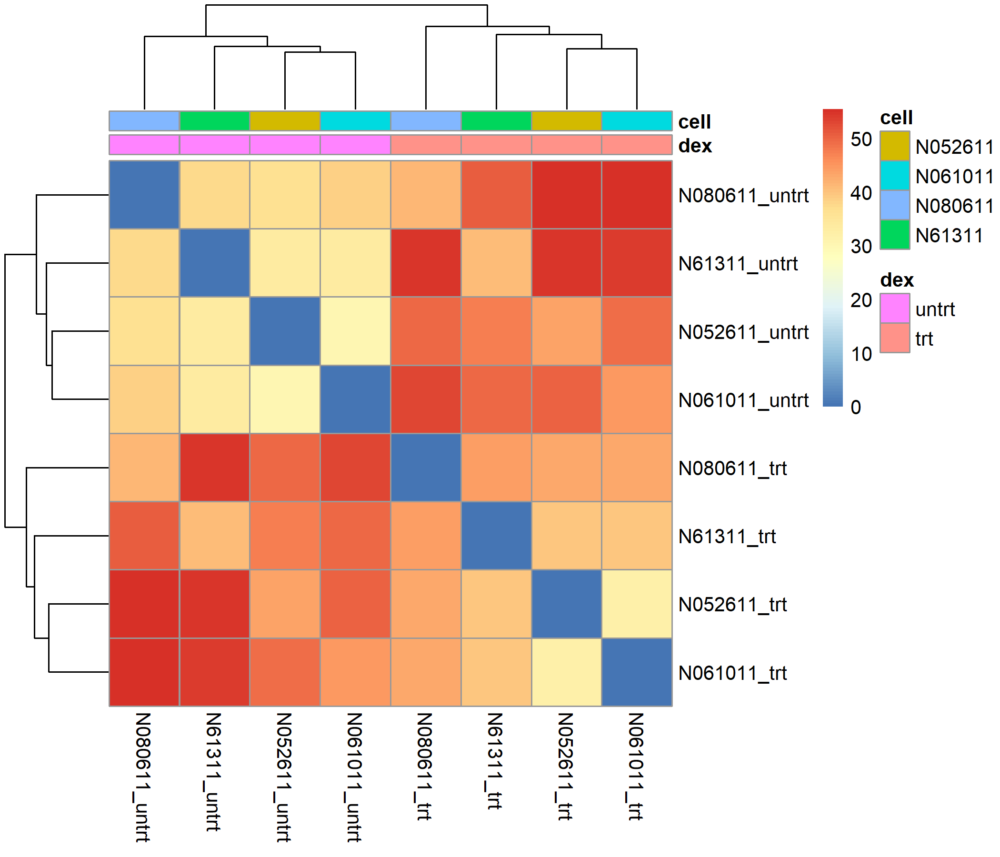
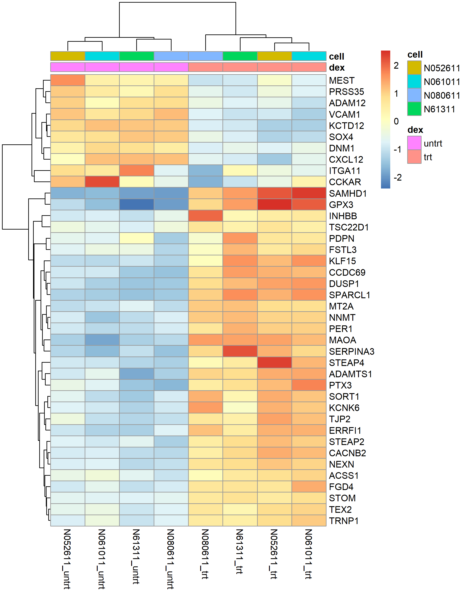

```{r setup}
#| message: false
#| warning: false
suppressPackageStartupMessages({
  library(tximport); library(DESeq2); library(tidyverse)
  library(pheatmap); library(EnhancedVolcano); library(ggrepel)
  library(clusterProfiler); library(org.Hs.eg.db)
})
theme_set(theme_bw(base_size = 12))
dir.create("../figures", showWarnings = FALSE)
```

# Question et référence

**Question.** Quels gènes changent d'expression quand des cellules musculaires lisses des voies
respiratoires humaines sont traitées à la dexaméthasone (un glucocorticoïde) ?

**Article de référence.** Himes BE *et al.*, *RNA-Seq Transcriptome Profiling Identifies CRISPLD2 as a
Glucocorticoid Responsive Gene that Modulates Cytokine Function in Airway Smooth Muscle Cells*,
PLoS ONE 2014;9(6):e99625 ([doi:10.1371/journal.pone.0099625](https://doi.org/10.1371/journal.pone.0099625)).
Quatre lignées primaires d'ASM (donneurs masculins blancs), dexaméthasone 1 µM pendant 18 h, Illumina
HiSeq 2000 en paires de 75 pb. Les auteurs ont aligné avec TopHat (hg19), quantifié avec Cufflinks et
testé avec Cuffdiff (FDR < 0,05) : **316 gènes** différentiellement exprimés.

**Ce travail.** Mêmes données publiques (GSE52778), mais une chaîne moderne : STAR + Salmon sur
GRCh38 / GENCODE v44 via nf-core/rnaseq, puis DESeq2 avec le design `~ cell + dex`.

# Import des comptages (tximport)

```{r import}
meta <- read_csv("../metadata.csv", show_col_types = FALSE) |>
  mutate(dex = factor(dex, levels = c("untrt", "trt")),
         cell = factor(cell))

files <- file.path(params$salmon_dir, meta$sample, "quant.sf")
names(files) <- meta$sample
stopifnot(all(file.exists(files)))

tx2gene <- read_tsv(file.path(params$salmon_dir, "salmon.merged.tx2gene.tsv"),
                    show_col_types = FALSE)   # colonnes : transcript_id, gene_id, gene_name

txi <- tximport(files, type = "salmon", tx2gene = tx2gene[, c("transcript_id", "gene_id")],
                ignoreTxVersion = FALSE)
gene_names <- distinct(tx2gene, gene_id, gene_name)
```

# DESeq2

Design `~ cell + dex` : la lignée cellulaire est une covariable de blocage. Les quatre donneurs ont
des niveaux d'expression de base différents ; les modéliser revient à comparer chaque lignée traitée à
**sa propre version non traitée** (test apparié). On retire ainsi la variabilité inter-donneur du bruit
du test, ce qui augmente la puissance.

```{r deseq}
coldata <- column_to_rownames(as.data.frame(meta), "sample")
stopifnot(identical(rownames(coldata), colnames(txi$counts)))
dds <- DESeqDataSetFromTximport(txi, colData = coldata, design = ~ cell + dex)
dds <- dds[rowSums(counts(dds) >= 10) >= 3, ]     # gènes détectés (>= 10 comptages dans >= 3 échantillons)
dds <- DESeq(dds)
res <- lfcShrink(dds, coef = "dex_trt_vs_untrt", type = "apeglm")

res_df <- as.data.frame(res) |>
  rownames_to_column("gene_id") |>
  left_join(gene_names, by = "gene_id") |>
  arrange(padj)
write_csv(res_df, "../results_deseq2.csv")

sig     <- res_df |> filter(!is.na(padj), padj < 0.05)
n_tested <- nrow(res_df)
n_sig    <- nrow(sig)
n_up     <- sum(sig$log2FoldChange > 0)
n_down   <- sum(sig$log2FoldChange < 0)
n_sig_l1 <- sum(abs(sig$log2FoldChange) > 1)
summary(res, alpha = 0.05)
```

**Bilan.** Sur **`r format(n_tested, big.mark = " ")`** gènes testés, **`r format(n_sig, big.mark = " ")`**
sont significatifs à padj < 0,05 (**`r n_up`** induits, **`r n_down`** réprimés), dont
**`r n_sig_l1`** avec un |log2FC| > 1. Les log2FC sont *rétrécis* par `apeglm` : ils sont prudents pour
les gènes peu exprimés, ce qui explique l'absence des fold changes extrêmes artificiels qu'on voit
avec les estimations brutes.

# 1. Contrôles qualité des échantillons

## 1.1 PCA

```{r pca}
vsd <- vst(dds, blind = FALSE)

pca_df <- function(obj) {
  d <- plotPCA(obj, intgroup = c("dex", "cell"), returnData = TRUE)
  attr(d, "pv") <- round(100 * attr(d, "percentVar"))
  d
}
plot_pca <- function(d, titre) {
  pv <- attr(d, "pv")
  ggplot(d, aes(PC1, PC2, colour = dex, shape = cell)) +
    geom_path(data = arrange(d, cell, dex), aes(group = cell), colour = "grey55",
              linewidth = 0.4, arrow = arrow(length = unit(2.5, "mm"), type = "closed")) +
    geom_point(size = 4) +
    geom_text_repel(aes(label = cell), size = 3, show.legend = FALSE, colour = "grey25",
                    box.padding = 0.4, min.segment.length = Inf) +
    scale_colour_manual(values = c(untrt = "#3B6FB6", trt = "#D9541E"),
                        labels = c(untrt = "Contrôle", trt = "Dexaméthasone"), name = "Traitement") +
    labs(title = titre, x = paste0("PC1 : ", pv[1], " % de variance"),
         y = paste0("PC2 : ", pv[2], " % de variance"), shape = "Lignée",
         caption = "Flèche : de la condition contrôle vers la condition traitée, pour une même lignée")
}

d1 <- pca_df(vsd)
p1 <- plot_pca(d1, "PCA des 500 gènes les plus variables (données brutes)")
ggsave("../figures/pca.png", p1, width = 7.5, height = 5.2, dpi = 200)
p1

# Même PCA après retrait de l'effet de la lignée (pour visualiser l'effet du traitement seul)
vsd_nb <- vsd
assay(vsd_nb) <- limma::removeBatchEffect(assay(vsd), batch = vsd$cell)
d2 <- pca_df(vsd_nb)
p2 <- plot_pca(d2, "PCA après retrait de l'effet de la lignée")
ggsave("../figures/pca_sans_lignee.png", p2, width = 7.5, height = 5.2, dpi = 200)
p2
```

**Lecture.** La **première composante (PC1, `r attr(d1, "pv")[1]` % de la variance)** sépare les
échantillons traités des échantillons contrôles, sans chevauchement. La **deuxième (PC2,
`r attr(d1, "pv")[2]` %)** sépare surtout la lignée `N080611` des trois autres. Les flèches, qui relient
chaque lignée entre ses deux conditions, vont toutes dans le même sens sur PC1.

**Interprétation.**

- L'effet de la dexaméthasone est la **source de variation dominante** : c'est ce qu'on attend d'une
  exposition à un glucocorticoïde à 1 µM.
- L'effet donneur est **réel mais secondaire** ; il justifie le terme `cell` dans le design. Une
  comparaison non appariée (traités contre contrôles sans tenir compte du donneur) gaspillerait cette
  information.
- Les flèches ne sont pas identiques : l'**ampleur de la réponse varie selon la lignée**. `N61311`
  avance moins loin sur PC1 que les trois autres, et `N080611` monte aussi sur PC2. Un effet
  traitement parfaitement identique chez tous les donneurs ne serait pas biologiquement réaliste.
- Le deuxième graphique retire l'effet moyen de chaque lignée : les quatre contrôles se regroupent à
  gauche, les quatre traités à droite, et PC1 capte alors **`r attr(d2, "pv")[1]` % de la variance
  restante**. Ce qui reste sur PC2 (`r attr(d2, "pv")[2]` %) correspond aux **différences de réponse
  entre donneurs** : `N080611` y monte, `N61311` y descend, les deux autres restent proches de zéro.
  C'est un effet faible, mais il montre que la réponse n'est pas identique partout.

Point de comparaison avec l'article : Himes *et al.* soulignent une **variabilité notable entre
donneurs** (ils le citent comme limite). Elle apparaît ici directement sur PC2.

## 1.2 Distance entre échantillons

```{r clustering}
d <- dist(t(assay(vsd)))
ann <- as.data.frame(colData(vsd)[, c("dex", "cell")])
pheatmap(as.matrix(d), clustering_distance_rows = d, clustering_distance_cols = d,
         annotation_col = ann,
         filename = "../figures/sample_clustering.png", width = 7, height = 6)

```

**Lecture.** Matrice des distances euclidiennes entre échantillons (sur les données stabilisées).
Bleu = proches, rouge = éloignés. Le dendrogramme coupe les 8 échantillons en **deux grands groupes :
les 4 contrôles et les 4 traités**.

**Interprétation.**

- Aucun échantillon ne se range dans le mauvais groupe : pas d'inversion d'étiquettes ni d'échantillon
  aberrant.
- Les **contrôles sont plus homogènes entre eux que les traités** (distances plus faibles dans le bloc
  contrôle). La dexaméthasone ne déplace donc pas tous les donneurs de la même façon, ce qui recoupe
  l'image de la PCA.
- `N080611_untrt` est le contrôle le plus éloigné des trois autres : c'est la même lignée que celle qui
  se détache sur PC2.

Dans le rapport MultiQC du pipeline (`results_slurm/multiqc/star_salmon/multiqc_report.html`), la
PCA et le clustering calculés sur les comptages Salmon donnent la même image.

# 2. Résultats d'expression différentielle

## 2.1 Volcan

```{r volcano}
etiq <- c("DUSP1", "KLF15", "PER1", "TSC22D3", "FKBP5", "CRISPLD2", "C7", "CCDC69")
p <- EnhancedVolcano(res_df, lab = res_df$gene_name, x = "log2FoldChange", y = "padj",
                     pCutoff = 0.05, FCcutoff = 1, title = "Dexaméthasone vs contrôle",
                     subtitle = "log2FC rétrécis (apeglm), padj de Benjamini-Hochberg",
                     selectLab = etiq, drawConnectors = TRUE, max.overlaps = Inf,
                     labSize = 4, pointSize = 1.5)
ggsave("../figures/volcano.png", p, width = 8, height = 7, dpi = 200)
p
```

**Lecture.** Chaque point est un gène. En abscisse, le log2 du changement d'expression (positif = induit
par la dexaméthasone) ; en ordonnée, la significativité (−log10 de la p ajustée). Rouge : padj < 0,05
**et** |log2FC| > 1.

**Interprétation.**

- Le nuage est **asymétrique** : les gènes les plus fortement induits (à droite) sont aussi les plus
  significatifs, avec `DUSP1` en tête de classement. La réponse transcriptionnelle à un glucocorticoïde
  est avant tout une **activation** de gènes, via le récepteur GR.
- Il y a cependant **beaucoup de gènes réprimés** (à gauche), avec une significativité élevée : la
  dexaméthasone ne fait pas qu'allumer des gènes.
- Les gènes de contrôle de l'article (`DUSP1`, `KLF15`, `PER1`, `TSC22D3`, `FKBP5`) sont bien dans le lot
  des gènes induits et significatifs. Les gènes nouveaux mis en avant par les auteurs
  (`CRISPLD2`, `C7`, `CCDC69`) le sont aussi.
- Quelques points isolés ont un changement extrême : `ALOX15B` (log2FC ≈ +11, expression moyenne
  faible, ≈ 65 comptages), `ZBTB16` (≈ +7, bien exprimé, ≈ 1 200 comptages), ainsi que deux transcrits
  peu exprimés vers −8 (`KBTBD11-OT1` et un gène non annoté). Pour les gènes peu exprimés, un rapport
  aussi grand repose sur très peu de lectures et reste à confirmer ; `ZBTB16`, bien détecté, est en
  revanche un signal robuste.

## 2.2 Les gènes les plus différentiels

```{r heatmap}
top <- res_df |> filter(!is.na(padj)) |> slice_head(n = 40)
mat <- assay(vsd)[top$gene_id, ]
rownames(mat) <- make.unique(top$gene_name)
mat <- mat - rowMeans(mat)
pheatmap(mat, annotation_col = ann,
         filename = "../figures/heatmap_top40.png", width = 7, height = 9)

```

**Lecture.** Expression (centrée par gène) des 40 gènes les plus significatifs. Chaque colonne est un
échantillon. Les colonnes se regroupent **d'elles-mêmes** en contrôles et traités ; les lignes se
séparent en deux blocs.

**Interprétation.**

- Un grand bloc de gènes **induits** (rouge chez les traités) : entre autres `SAMHD1`, `GPX3`, `KLF15`,
  `DUSP1`, `SPARCL1`, `PER1`, `MAOA`, `STEAP4`, `SERPINA3`, `ADAMTS1`, `PTX3`, `CACNB2`. Les quatre
  donneurs répondent dans le **même sens**, avec des intensités un peu différentes.
- Un petit bloc de gènes **réprimés** (haut de la figure) : `VCAM1`, `CXCL12`, `SOX4`, `ADAM12`, `MEST`,
  `ITGA11`, `KCTD12`. La répression de molécules d'adhésion et de chimiokines va dans le sens d'un effet
  anti-inflammatoire de la dexaméthasone, sans que je l'aie vérifié gène par gène dans la littérature.
- Dans le groupe des traités, `N080611_trt` se place un peu à part, comme sur la PCA.

# 3. Comparaison quantitative avec l'article

Les auteurs ont validé par qPCR huit gènes (cinq connus, trois nouveaux) et en donnent les FPKM moyens
sans puis avec dexaméthasone. Le rapport des deux donne un fold change qu'on peut comparer aux nôtres.

```{r comparaison}
#| fig-height: 4.6
# FPKM moyens (contrôle, dexaméthasone) relevés dans Himes et al. 2014 : à revérifier dans l'article.
art <- tribble(
  ~gene_name, ~fpkm_ctrl, ~fpkm_dex,
  "DUSP1",    18.26, 144.96,
  "FKBP5",     3.43,  53.05,
  "KLF15",     0.86,  20.46,
  "PER1",      1.49,  13.69,
  "TSC22D3",   9.69,  93.26,
  "CRISPLD2",  7.89,  51.17,
  "C7",        3.76,  38.41,
  "CCDC69",    6.24,  47.39
) |> mutate(fc_article = fpkm_dex / fpkm_ctrl)

cmp <- art |>
  left_join(res_df |> dplyr::select(gene_name, log2FoldChange, padj), by = "gene_name") |>
  mutate(fc_ici = 2^log2FoldChange,
         rapport = fc_ici / fc_article)

cmp |> transmute(Gène = gene_name,
                 `FC article (FPKM)` = round(fc_article, 1),
                 `FC ici (DESeq2)` = round(fc_ici, 1),
                 `padj ici` = signif(padj, 2)) |>
  knitr::kable()

p <- ggplot(cmp, aes(fc_article, fc_ici, label = gene_name)) +
  geom_abline(slope = 1, intercept = 0, linetype = 2, colour = "grey50") +
  geom_point(size = 3, colour = "#D9541E") +
  geom_text_repel(size = 3.5) +
  scale_x_log10() + scale_y_log10() +
  labs(x = "Fold change, Himes et al. 2014 (rapport de FPKM)",
       y = "Fold change, cette analyse (DESeq2, STAR + Salmon)",
       title = "Concordance sur les gènes validés par les auteurs",
       caption = "Pointillés : égalité parfaite (axes logarithmiques)")
ggsave("../figures/comparaison_article.png", p, width = 7, height = 5, dpi = 200)
p
```

**Lecture.** Chaque point est l'un des huit gènes validés. Sur la diagonale en pointillés, l'analyse
reproduit exactement le fold change publié.

**Interprétation.**

- Les **huit gènes sont retrouvés, tous induits et très significatifs** (padj < 1e-11). La quasi-totalité
  des points tombe près de la diagonale. Sur `DUSP1`, `PER1`, `CRISPLD2`, `CCDC69`, `TSC22D3`, `KLF15`,
  le fold change est à quelques dizaines de pourcents de la valeur publiée.
- Les écarts les plus nets sont sur `C7` et `TSC22D3` (un peu plus faibles ici) ; ils restent modestes.
  Pour les gènes peu exprimés à l'état basal, un FPKM moyen n'est pas directement comparable à un
  log2FC rétréci, donc je n'en tire pas de conclusion.
- **`CRISPLD2`**, le gène mis en avant par les auteurs, est retrouvé avec un fold change d'environ 6 (6,5
  dans l'article) et un padj de l'ordre de 1e-47. Ce résultat central de la publication est reproduit.

Cette concordance sur des gènes validés expérimentalement est le **meilleur argument que la chaîne
d'analyse est correcte**, malgré des outils différents (STAR/Salmon/DESeq2 contre
TopHat/Cufflinks/Cuffdiff) et un génome différent (GRCh38 contre hg19).

## Différences de méthode à garder en tête

| | Himes *et al.* 2014 | Cette analyse |
|---|---|---|
| Génome / annotation | hg19, RefSeq | GRCh38, GENCODE v44 |
| Alignement | TopHat 2.0.4 | STAR (via nf-core/rnaseq 3.27.0) |
| Quantification | Cufflinks (FPKM) | Salmon, agrégé au gène avec tximport |
| Test | Cuffdiff, FDR < 0,05 | DESeq2 `~ cell + dex`, padj < 0,05 |
| Gènes significatifs | 316 | `r format(n_sig, big.mark = " ")` |

**Pourquoi 316 contre `r format(n_sig, big.mark = " ")` ?** Je n'ai pas de démonstration, seulement des
hypothèses plausibles : DESeq2 avec le donneur comme covariable est plus puissant qu'un test qui ne
modélise pas l'appariement ; Cuffdiff est connu pour être conservateur avec peu de réplicats ; les
annotations (RefSeq contre GENCODE) et les filtres diffèrent. Je n'ai pas testé ces explications, et je
n'ai pas accès à la liste des 316 gènes pour mesurer le recouvrement exact. Ce qui est solide :
**les gènes forts et validés sont les mêmes**.

# 4. Enrichissement fonctionnel

```{r enrich}
#| fig-height: 5.5
strip <- \(x) sub("[.].*$", "", x)
univ  <- res_df |> filter(!is.na(padj)) |> pull(gene_id) |> strip()
ids_up   <- res_df |> filter(padj < 0.05, log2FoldChange >  1) |> pull(gene_id) |> strip()
ids_down <- res_df |> filter(padj < 0.05, log2FoldChange < -1) |> pull(gene_id) |> strip()

go <- function(ids) enrichGO(ids, OrgDb = org.Hs.eg.db, keyType = "ENSEMBL", ont = "BP",
                             universe = univ, pAdjustMethod = "BH", qvalueCutoff = 0.05,
                             readable = TRUE)
ego_up   <- go(ids_up)
ego_down <- go(ids_down)

p_up <- dotplot(ego_up, showCategory = 15) + ggtitle("GO BP : gènes induits (padj < 0,05, log2FC > 1)")
ggsave("../figures/go_up.png", p_up, width = 8, height = 6, dpi = 200)
p_up
```

**Lecture.** Processus biologiques GO enrichis parmi les gènes induits. La taille du point donne le
nombre de gènes du processus ; la couleur, la p ajustée ; l'abscisse, la part des gènes induits qui
appartiennent au processus.

**Interprétation et comparaison avec l'article.** Les auteurs (analyse DAVID sur leurs 316 gènes) ont
trouvé des groupes liés à la **matrice extracellulaire et aux glycoprotéines, au développement vasculaire,
aux processus du système circulatoire et à la réponse aux hormones**. Nous retrouvons dans les gènes
induits :

- **organisation de la matrice extracellulaire** et **adhésion cellule-substrat** ;
- **morphogenèse des vaisseaux sanguins** et **processus du système circulatoire** ;
- en plus : **processus et adaptation du système musculaire**, **catabolisme des acides aminés**,
  **métabolisme des espèces réactives de l'oxygène**.

Le recoupement avec l'article est bon sur la matrice extracellulaire et le système vasculaire. Les termes
musculaires sont cohérents avec le type cellulaire étudié (muscle lisse). Le catabolisme des acides aminés
rappelle l'effet métabolique connu des glucocorticoïdes, mais c'est une lecture de ma part, pas un
résultat de l'article. Je n'ai pas retrouvé dans les 15 premiers termes la « réponse aux nutriments » ni
les domaines thrombospondine cités par les auteurs ; l'absence dans ce graphique ne prouve pas l'absence
d'enrichissement.

```{r enrich-down}
#| fig-height: 5.5
p_dn <- dotplot(ego_down, showCategory = 15) + ggtitle("GO BP : gènes réprimés (padj < 0,05, log2FC < -1)")
ggsave("../figures/go_down.png", p_dn, width = 8, height = 6, dpi = 200)
p_dn
```

**Lecture et interprétation.** Les gènes réprimés sont enrichis en **développement de l'axone,
morphogenèse des projections cellulaires, guidage, chimiotaxie et circulation sanguine**. Ce sont des
processus de croissance et de migration cellulaires. La répression de la chimiotaxie va dans le sens d'un
effet anti-inflammatoire, mais l'article présenté ici ne décrit pas cette analyse pour les gènes réprimés,
donc il n'y a pas de comparaison directe à faire. Les termes neuronaux (axone) sont surprenants pour du
muscle lisse : ils viennent vraisemblablement de gènes de guidage partagés (sémaphorines, ephrines,
etc.), sans que je l'aie vérifié dans la liste.

```{r kegg}
ids <- bitr(ids_up, "ENSEMBL", "ENTREZID", org.Hs.eg.db)$ENTREZID
kegg <- tryCatch(enrichKEGG(ids, organism = "hsa"), error = function(e) NULL)
if (is.null(kegg)) {
  cat("KEGG indisponible (pas d'accès au serveur).")
} else {
  as.data.frame(kegg)[, c("Description", "GeneRatio", "p.adjust", "Count")] |>
    head(10) |> knitr::kable(digits = 4, row.names = FALSE)
}
```

**KEGG (gènes induits).** Les voies significatives sont le **cytosquelette dans les cellules musculaires**,
la **signalisation des intégrines** et l'**interaction récepteur-matrice extracellulaire**. Elles
confirment le signal GO : un remodelage de la matrice et de l'adhésion, propre à ce type cellulaire.

# 5. Contrôle de cohérence : gènes connus

```{r known}
known <- c("DUSP1", "KLF15", "PER1", "TSC22D3", "FKBP5", "CRISPLD2", "C7", "CCDC69")
res_df |> filter(gene_name %in% known) |>
  dplyr::select(gene_name, baseMean, log2FoldChange, padj) |>
  arrange(desc(log2FoldChange)) |>
  knitr::kable(digits = 4)
```

Les quatre gènes cités dans l'article comme réponse glucocorticoïde connue (`DUSP1`, `KLF15`, `PER1`,
`TSC22D3`) sont tous **induits et significatifs**, avec `FKBP5` et les trois gènes nouveaux.

# 6. Limites

- **Quatre donneurs seulement**, tous des hommes blancs sans asthme, comme le signalent les auteurs : les
  résultats ne se généralisent pas à des patients asthmatiques, qui peuvent répondre différemment.
- **Un seul temps** (18 h) : la réponse à un glucocorticoïde évolue dans le temps.
- **Une seule dose** (1 µM) : aucune relation dose-réponse.
- **Enrichissements** : les termes GO sont larges et redondants (plusieurs termes partagent les mêmes
  gènes) ; les p ajustées sont de l'ordre de 1e-3, significatives mais pas extrêmes.
- **Le lien avec l'asthme** (CRISPLD2 et la résistance aux corticoïdes) vient de la génétique et des
  expériences de l'article, pas de cette analyse, qui ne fait que reproduire la signature d'expression.

# Reproductibilité

Pipeline : `nf-core/rnaseq` 3.27.0 (`-profile apptainer`, Nextflow 26.04.4 avec `NXF_SYNTAX_PARSER=v1`),
GENCODE v44 / GRCh38, `--aligner star_salmon`. Voir `run_slurm.sh`.

```{r session}
sessionInfo()
```
