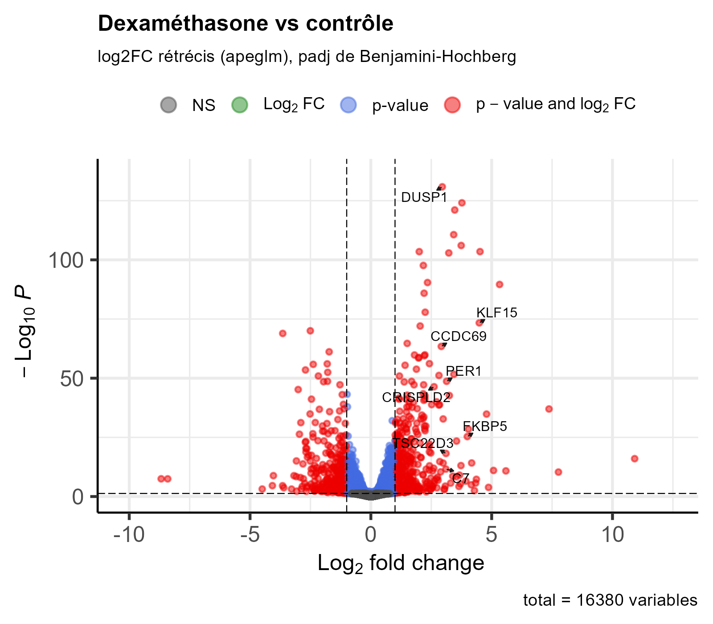

```{r setup}
#| message: false
suppressPackageStartupMessages({
  library(tximport); library(DESeq2); library(tidyverse)
  library(pheatmap); library(EnhancedVolcano)
  library(clusterProfiler); library(org.Hs.eg.db)
})
dir.create("../figures", showWarnings = FALSE)
```

## Import des comptages (tximport)

```{r import}
meta <- read_csv("../metadata.csv", show_col_types = FALSE) |>
  mutate(dex = factor(dex, levels = c("untrt", "trt")),
         cell = factor(cell))

files <- file.path(params$salmon_dir, meta$sample, "quant.sf")
names(files) <- meta$sample
stopifnot(all(file.exists(files)))

tx2gene <- read_tsv(file.path(params$salmon_dir, "tx2gene.tsv"),
                    col_names = c("tx", "gene_id", "gene_name"), show_col_types = FALSE)

txi <- tximport(files, type = "salmon", tx2gene = tx2gene[, 1:2],
                ignoreTxVersion = FALSE)
gene_names <- distinct(tx2gene, gene_id, gene_name)
```

## DESeq2

Design `~ cell + dex` : la lignée cellulaire est une covariable de blocage. Les 4 lignées
donnent des niveaux d'expression de base différents ; les modéliser retire cette variabilité
inter-donneur et augmente la puissance du test traité vs contrôle (test apparié).

```{r deseq}
dds <- DESeqDataSetFromTximport(txi, colData = column_to_rownames(meta, "sample"),
                                design = ~ cell + dex)
dds <- dds[rowSums(counts(dds) >= 10) >= 3, ]
dds <- DESeq(dds)
res <- lfcShrink(dds, coef = "dex_trt_vs_untrt", type = "apeglm")

res_df <- as.data.frame(res) |>
  rownames_to_column("gene_id") |>
  left_join(gene_names, by = "gene_id") |>
  arrange(padj)
write_csv(res_df, "../results_deseq2.csv")
summary(res, alpha = 0.05)
```

## PCA et clustering

```{r pca}
vsd <- vst(dds, blind = FALSE)
p <- plotPCA(vsd, intgroup = c("dex", "cell")) + theme_bw()
ggsave("../figures/pca.png", p, width = 6, height = 4.5, dpi = 200)
p

# PCA après retrait de l'effet lignée : le signal dex devient dominant
vsd_nb <- vsd
assay(vsd_nb) <- limma::removeBatchEffect(assay(vsd), batch = vsd$cell)
plotPCA(vsd_nb, intgroup = c("dex", "cell")) + theme_bw()

d <- dist(t(assay(vsd)))
png("../figures/sample_clustering.png", 900, 800, res = 150)
pheatmap(as.matrix(d), clustering_distance_rows = d, clustering_distance_cols = d,
         annotation_col = as.data.frame(colData(vsd)[, c("dex", "cell")]))
dev.off()
```

## Volcano plot

```{r volcano}
png("../figures/volcano.png", 1400, 1100, res = 200)
EnhancedVolcano(res_df, lab = res_df$gene_name, x = "log2FoldChange", y = "padj",
                pCutoff = 0.05, FCcutoff = 1, title = "Dex vs contrôle",
                subtitle = NULL, selectLab = c("DUSP1", "KLF15", "PER1", "TSC22D3", "FKBP5", "CDKN1C"),
                drawConnectors = TRUE)
dev.off()

```

## Heatmap des 40 gènes les plus différentiels

```{r heatmap}
top <- res_df |> filter(!is.na(padj)) |> slice_head(n = 40)
mat <- assay(vsd)[top$gene_id, ]
rownames(mat) <- make.unique(top$gene_name)
mat <- mat - rowMeans(mat)
png("../figures/heatmap_top40.png", 1000, 1200, res = 150)
pheatmap(mat, annotation_col = as.data.frame(colData(vsd)[, c("dex", "cell")]))
dev.off()
knitr::include_graphics("../figures/heatmap_top40.png")
```

## Contrôle de cohérence : gènes connus

```{r known}
known <- c("DUSP1", "KLF15", "PER1", "TSC22D3")
res_df |> filter(gene_name %in% known) |>
  select(gene_name, log2FoldChange, padj) |> knitr::kable(digits = 4)
```

Tous quatre doivent être significativement **sur-exprimés** après dexaméthasone
(log2FC > 0, padj < 0,05) ; sinon vérifier `strandedness`, l'ordre des niveaux de `dex`
et la correspondance échantillon/fichier.

## Enrichissement fonctionnel (clusterProfiler)

```{r enrich}
strip <- \(x) sub("\\..*$", "", x)   # retire la version ENSG
up   <- res_df |> filter(padj < 0.05, log2FoldChange >  1) |> pull(gene_id) |> strip()
univ <- res_df |> filter(!is.na(padj)) |> pull(gene_id) |> strip()

ego <- enrichGO(up, OrgDb = org.Hs.eg.db, keyType = "ENSEMBL", ont = "BP",
                universe = univ, pAdjustMethod = "BH", qvalueCutoff = 0.05, readable = TRUE)
p <- dotplot(ego, showCategory = 15) + ggtitle("GO BP : gènes induits par la dex")
ggsave("../figures/go_up.png", p, width = 8, height = 6, dpi = 200)
p

ids <- bitr(up, "ENSEMBL", "ENTREZID", org.Hs.eg.db)$ENTREZID
ekegg <- enrichKEGG(ids, organism = "hsa")   # nécessite Internet
head(as.data.frame(ekegg))
```

## Reproductibilité

```{r session}
sessionInfo()
```
